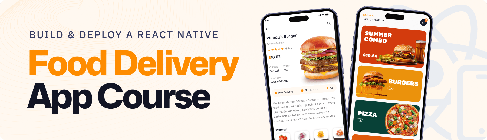

<div align="center">
  <br />
    <a href="https://github.com/yourusername/food_ordering" target="_blank">
      
    </a>
  <br />

  <div>
    
    
        
    
    
  </div>

  <h3 align="center">🍔 Chomp - Food Delivery App</h3>

   <div align="center">
     A modern, fully-functional food delivery app built with React Native, Expo, and Appwrite. Features dynamic search, cart functionality, user authentication, and a beautiful gradient UI with Chomp branding.
    </div>
</div>

## 📋 <a name="table">Table of Contents</a>

1. 🤖 [Introduction](#introduction)
2. ⚙️ [Tech Stack](#tech-stack)
3. 🔋 [Features](#features)
4. 🤸 [Quick Start](#quick-start)
5. 🔗 [Assets](#links)
6. 🚀 [More](#more)

## ✨ Recent Updates

This project has been completely refactored and improved with the following enhancements:

- ✅ **Fixed Search Functionality**: Search now works with local data fallback when Appwrite database is empty
- ✅ **Interactive Home Page**: Offer cards are now clickable and navigate to filtered search results
- ✅ **Dynamic Location**: Location display is now interactive and can be updated by users
- ✅ **Complete Profile Page**: Added logout functionality, user information display, and proper design
- ✅ **Database Fallback**: App now works without Appwrite setup using local data
- ✅ **Better Error Handling**: Improved loading states and empty state handling
- ✅ **Enhanced UI/UX**: Better visual feedback and user interactions throughout the app
- ✅ **New Chomp Branding**: Complete rebrand with gradient colors
- ✅ **Redesigned Auth Pages**: Beautiful sign-in/sign-up pages with modern gradient design
- ✅ **Product Detail Pages**: Comprehensive product information and ordering experience

## <a name="introduction">🤖 Introduction</a>

Built with React Native, TypeScript, and Tailwind CSS, **Chomp** is a full-stack Food Delivery app featuring beautiful gradient UI design, user authentication, dynamic search and filters, cart functionality, and smooth navigation. Powered by Appwrite for backend, database, and file storage, it delivers a responsive, scalable, and intuitive user experience with modern UI/UX best practices and stunning visual design.
## <a name="tech-stack">⚙️ Tech Stack</a>

- **[Appwrite](https://jsm.dev/rn25-appwrite)** is an open-source backend-as-a-service platform offering secure authentication (email/password, OAuth, SMS, magic links), databases, file storage with compression/encryption, real-time messaging, serverless functions, and static site hosting via Appwrite Sites—all managed through a unified console and microservices architecture.

- **[Expo](https://expo.dev/)** is an open-source platform for building universal native apps (Android, iOS, web) using JavaScript/TypeScript and React Native. It features file-based routing via Expo Router, fast refresh, native modules for camera/maps/notifications, over-the-air updates (EAS), and streamlined app deployment.

- **[NativeWind](https://www.nativewind.dev/)** brings Tailwind CSS to React Native and Expo, allowing you to style mobile components using utility-first classes for fast, consistent, and responsive UI design.

- **[React Native](https://reactnative.dev/)** is a framework for building mobile UIs with React. It enables component‑based, cross-platform development with declarative UI, deep native API support, and is tightly integrated with Expo for navigation and native capabilities.

- **[Tailwind CSS](https://tailwindcss.com/)** is a utility-first CSS framework enabling rapid UI design via low-level classes. In React Native/Expo, it’s commonly used with NativeWind to apply Tailwind-style utilities to mobile components.

- **[TypeScript](https://www.typescriptlang.org/)** is a statically-typed superset of JavaScript providing type annotations, interfaces, enums, generics, and enhanced tooling. It improves error detection, code quality, and scalability—ideal for robust, maintainable projects.

- **[Zustand](https://github.com/pmndrs/zustand)** is a minimal, hook-based state management library for React and React Native. It lets you manage global state with zero boilerplate, no context providers, and excellent performance through selective state subscriptions.

- **[Sentry](https://jsm.dev/rn-food-sentry)** is a powerful error tracking and performance monitoring tool for React Native apps. It helps you detect, diagnose, and fix issues in real-time to improve app stability and user experience.


## <a name="features">🔋 Features</a>

### Core Features

👉 **🔐 User Authentication**: Secure sign-in/sign-up with email and password using Appwrite  

👉 **🏠 Interactive Home Page**: Clickable offer cards that navigate to filtered search results  

👉 **🔍 Advanced Search**: Real-time search with category filters and keyword matching  

👉 **🛒 Shopping Cart**: Add/remove items, quantity management, and price calculation  

👉 **👤 Complete Profile**: User information display, logout functionality, and settings  

👉 **📍 Dynamic Location**: Interactive location selection and display  

👉 **📱 Responsive Design**: Beautiful UI with Tailwind CSS and NativeWind  

👉 **🔄 Data Fallback**: Works with or without Appwrite database setup  

👉 **⚡ Real-time Updates**: Live search results and cart updates  

👉 **🎨 Modern UI/UX**: Smooth animations, loading states, and intuitive navigation

## <a name="quick-start">🤸 Quick Start</a>

Follow these steps to set up the project locally on your machine.

**Prerequisites**

Make sure you have the following installed on your machine:

- **[Git](https://git-scm.com/)**
- **[Node.js](https://nodejs.org/en)**
- **[npm](https://www.npmjs.com/)** _(Node Package Manager)_

**Cloning the Repository**

```bash
git clone https://github.com/adrianhajdin/food_ordering.git
cd food_ordering
```

**Installation**

Install the project dependencies using npm:

```bash
npm install
```

**Set Up Environment Variables (Optional)**

The app now works with local data by default, but you can optionally set up Appwrite for cloud database functionality.

Create a new file named `.env` in the root of your project and add the following content:

```env
EXPO_PUBLIC_APPWRITE_PROJECT_ID=your_project_id_here
EXPO_PUBLIC_APPWRITE_ENDPOINT=https://cloud.appwrite.io/v1
```

**Note**: If you don't set up Appwrite, the app will automatically use local data. To set up Appwrite:
1. Sign up at [Appwrite Cloud](https://cloud.appwrite.io)
2. Create a new project
3. Set up your database and collections
4. Add your credentials to the `.env` file

**Running the Project**

```bash
npx expo start
```

Open your ExpoGO app on your phone and scan the QR code to view the project.

**Alternative: Run on Web**

```bash
npx expo start --web
```

**Alternative: Run on Simulator**

```bash
# For iOS Simulator
npx expo start --ios

# For Android Emulator  
npx expo start --android
```

## 🎯 How to Use

1. **Sign Up/Sign In**: Create an account or sign in with existing credentials
2. **Browse Offers**: Tap on offer cards on the home page to see filtered food items
3. **Search & Filter**: Use the search bar and category filters to find specific foods
4. **Add to Cart**: Tap "Add to Cart" on any food item to add it to your cart
5. **Manage Cart**: View your cart, adjust quantities, and see total pricing
6. **Update Location**: Tap on the location at the top to change your delivery address
7. **Profile Management**: View your profile information and logout when needed

## 🛠️ Project Structure

```
food_ordering/
├── app/                    # App router pages
│   ├── (auth)/            # Authentication pages
│   └── (tabs)/            # Main app tabs
├── components/            # Reusable UI components
├── constants/             # App constants and data
├── lib/                   # Utility functions and hooks
├── store/                 # Zustand state management
├── assets/                # Images, icons, fonts
└── type.d.ts             # TypeScript type definitions
```

## 🐛 Troubleshooting

**Common Issues:**

- **App not loading**: Make sure you've run `npm install` and `npx expo start`
- **Search not working**: The app uses local data by default, so search should work immediately
- **Authentication issues**: Check your Appwrite setup or use the local fallback
- **Build errors**: Clear cache with `npx expo start --clear`

## 🤝 Contributing

Contributions are welcome! Please feel free to submit a Pull Request.

## 📄 License

This project is licensed under the MIT License - see the [LICENSE](LICENSE) file for details.

## 🙏 Acknowledgments

- Built with [React Native](https://reactnative.dev/)
- Styled with [NativeWind](https://www.nativewind.dev/)
- Backend powered by [Appwrite](https://appwrite.io/)
- Icons and assets from various sources
